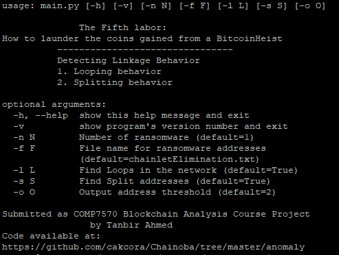
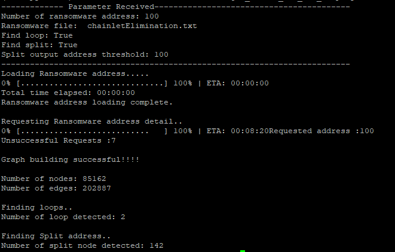

## Project
The Fifth Labor: How to launder the coins gained from a BitcoinHeist

## Run

> Run the following command to see the project information running configuration
```
python3 main.py -h
```
>
>
>
> Sample run command example
```
python3 main.py -n 100 -l True -s True -o 100
```

>

